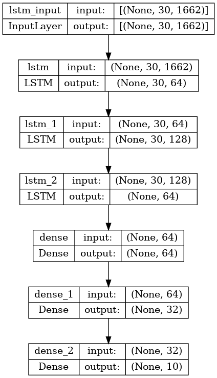

# CompRobo-Computer-Vision-23

Course: A Computational Introduction to Robotics, Fall 2023

Professor: Paul Ruvolo

## Project Goal

The goal of this project was to explore computer vision within the context of sign language translation. I wanted to focus on real-time sign language translation, as opposed to doing image recognition on static photos; this is effectively action recognition, where all of the actions are words in sign language.

Part of the framing of this project was to learn at a high level and implement a new machine learning algorithm. I took ML a couple years ago, where I worked with multilayer perceptrons (MLPs), generative adversarial networks (GANs), and convolutional neural networks (CNNs). For this project, I implemented a long short-term memory (LSTM) algorithm, which differs from all of the above models in the sense that it is a type of recurrent neural network (RNN), and thus has “memory” and can make decisions based on sequential data, which is good for analyzing a real-time feed of data.

Additionally, I planned to do some reading about where this kind of tool is already being used, its benefits, and its negatives. I see this as a tool with a lot of potential to assist communication between those who use sign language and those who do not. I aimed to look into the social implications of this technology and what should be done to make sure that it is implemented equitably.

As a stretch goal, I planned to learn at a low level how LSTMs work, such that I can write out and/or describe the math and implement the model from scratch.

As a minimum viable product (MVP) for this project, I planned to follow along and implement the sign language recognition algorithm outlined in [this YouTube tutorial](https://www.youtube.com/watch?v=doDUihpj6ro). I was successful in implementing the MVP early on in the project, but I got hung on on implementation details and model-training quirks when making improvements to the algorithm; as a result, I was not quite able to explore social context or learn how the model works at a low level, as outlined by my strech goals.

## Implementation Details

### Dependencies

Make sure to install the following dependencies for Python before running the code in this repository. Add the files in the Google Drive folder to the root level of the repository to avoid collecting data and training the model (unzip files with a .zip extensions), which are time-consuming processes.

- TensorFlow
- OpenCV-Python
- MediaPipe
- scikit-learn
- Matplotlib
- [Files in this Folder](https://drive.google.com/drive/folders/1j_HCrhukWvCwATvi8vavOUxSfb0K09kA?usp=sharing)

### High Level Structure of the Code

The code is split into three classes that have a distinct role, and a driver file called `main.py`, which is a python script that instantiates each of the classes and runs the appropriate methods to collect data, train a sign language recognition model, and make real-time predictions with the trained model. The classes and their responsibilities are the following:

- dataProcessor
  - loop through video samples in the video folder, map them to a class (the word/action that the video is showing), and create a directory called `WLASLData` to hold data extracted from the video samples
- keypointExtractor
  - loop through video samples in the video folder and for each of 30 sequential frames of the video, collect keypoints (locations in space for many points on face and hands) and save to file
  - given a trained model, open a camera feed or a video and analyze sign language in real time
- trainedModel
  - format keypoint data into training and testing sets and set up, build, and train a Keras LSTM

Below is a deeper dive into how each class was implemented, including which technologies are used. Furthermore, although this was initially based on a tutorial, the code has been almost entirely restructured to be my own; I will point out when code is not mine. The tutorial was done in a Jupyter notebook, with a global variable space and some functions. I refactored the code completely to be class-based with a very clean driver file and docstrings for each class and all of its methods.

### dataProcessor Implemetation

The video data comes from [this Kaggle dataset](https://www.kaggle.com/datasets/risangbaskoro/wlasl-processed?select=WLASL_v0.3.json), which came as a folder of videos with numerical ids, and a JSON file with information on each video. The JSON file had the classes as the upper level of the JSON structure, but I needed a way to get the class of the video based on its id, so I wrote a method to traverse the whole JSON file and create a new dictionary with video ids as the top level key. A smaller job of this class was to create a directory structure to hold the video keypoints and a list of class labels based on the videos present in the videos folder.

Because the tutorial did not use video data and created its dataset manually, this was not part of the tutorial; I wrote this code on my own.

### keypointExtractor Implementation

The keypointExtractor class relies heavily on two packages, OpenVC and MediaPipe. MediaPipe is a Google-developed product that allows anyone to use machine learning products on their devices. Specifically, I utilized the MediaPipe Holistic Landmarker, which detects 33 pose, 468 face, and 21 hand (each) landmarks, as shown in the image below. OpenCV was used in conjuntion with this technology to allow it to run on a live feed or a video. More specifically, I used OpenCV to play each video and set the video to 30 evenly-spaced frames in order to collect data on the whole action. For each of the 30 frames for each video sample, I used MediaPipe to detect the keypoints. The model was trained on the sequential keypoint data.

<figure
    style=
        "display: block;
        margin-left: auto;
        margin-right: auto;
        width:60%;"
>
    
</figure>

Most of the methods in this class are very similar to the implementation in the tutorial video. The major difference is that I modified the data collection method to work on videos rather than a live feed.

### trainedModel Implementation

This class is responsible for training the machine learning model. Because I did not build the model from scratch, this class utillizes Keras from the TensorFlow package to build and train the model (architecture show below). The model contains three LSTM layers and three dense layers. The input to an LSTM layer is a 2D array because the layer processes sequential data; in this case it is 1662 keypoints from each of the 30 frames. Dense layers are fully connected neural network layers that consolidate the information into a 1D output vector whose length is the number of classes.

<figure
    style=
        "display: block;
        margin-left: auto;
        margin-right: auto;
        width:60%;"
>
    
</figure>

I used the same architecture that was provided in the tutorial video; however, I made modifications to the training parameters in order to train more optimally. Most notably, I added functionality to decrease the model's learning rate if the loss stops decreasing for a certain amount of time, and I also have the model quit training early if it hits a plateau. If the model quits early, it will save the weights from the epoch where the loss was the lowest.

### Results

Early on, I tried training the model on all of the data that I have available, which is 2000 classes (actions), with an average of 5 video samples per class. The training was incredibly slow, and the final accuracy of the model was only about 1%. I think there are a couple reasons for this. The first is simply that I do not have enough training data; however, data processing and training is already incredibly time and space intensive, so I did not want to look for more data. The second is that the architecture of the model is not optimized for this type of classification; I did not change the overall architecture, but as mentioned above, I did change how the model trains.

The best solution that I ended up with was to limit the amount of training data to a subset of all the available classes; I ended up choosing the alphabet, as there are only 26 classes, and the motions are easy to learn. Training went much better, with accuracy on the training data reaching close to 100%, as shown in the accuracy and loss plots below; however, the model likely overfit to the training data, as real-time prediction performs very badly.

<figure
    style=
        "display: block;
        margin-left: auto;
        margin-right: auto;
        width:60%;"
>
    
</figure>
<figure
    style=
        "display: block;
        margin-left: auto;
        margin-right: auto;
        width:60%;"
>
    
</figure>

### Real-Time Prediction

<figure
    style=
        "display: block;
        margin-left: auto;
        margin-right: auto;
        width:60%;"
>
    
</figure>

## Design Decisions

**Describe a design decision you had to make when working on your project and what you ultimately did (and why)? These design decisions could be particular choices for how you implemented some part of an algorithm or perhaps a decision regarding which of two external packages to use in your project.**

## Challenges

**What if any challenges did you face along the way?**

## Future Improvements

**What would you do to improve your project if you had more time?**

## Lessons Learned

**Did you learn any interesting lessons for future robotic programming projects? These could relate to working on robotics projects in teams, working on more open-ended (and longer term) problems, or any other relevant topic.**

## Resources Used

- [Sign Language Detection using ACTION RECOGNITION with Python | LSTM Deep Learning Model](https://www.youtube.com/watch?v=doDUihpj6ro)
- [WLASL (World Level American Sign Language) Video](https://www.kaggle.com/datasets/risangbaskoro/wlasl-processed?select=WLASL_v0.3.json)
  - 12k processed videos of Word-Level American Sign Language glossary performance
